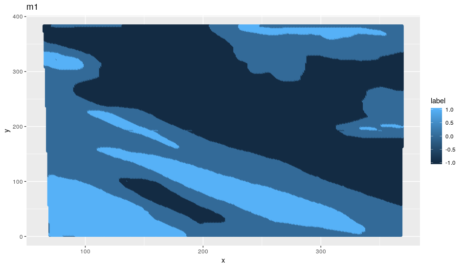
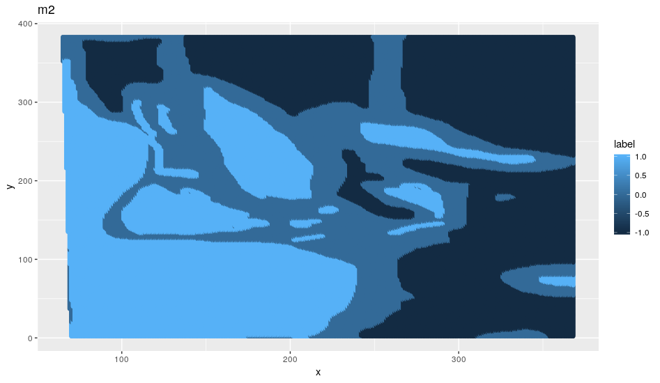
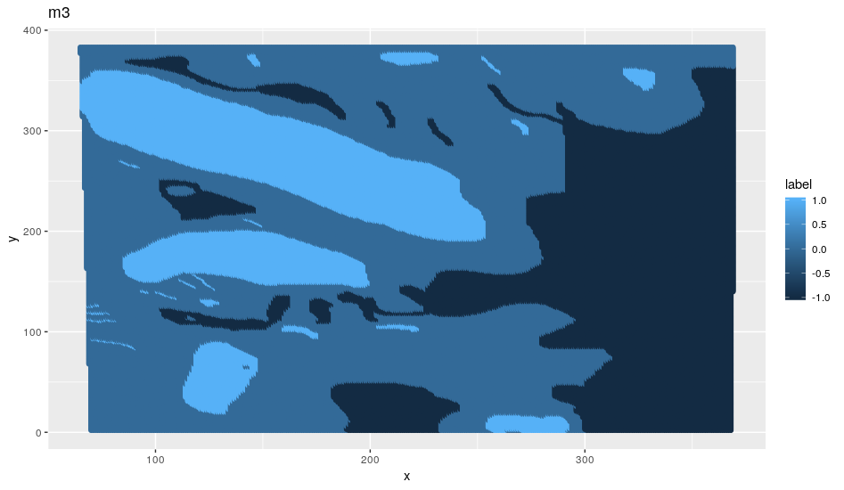

# stat-154-project

## Overview of the project (first paragraph of the spec)
The goal of this project is the exploration and modeling of cloud detection in the polar
regions based on radiance recorded automatically by the MISR sensor abroad the NASA
satellite Terra. You will attempt to build a classification model to distinguish the presence
of cloud from the absence of clouds in the images using the available signals/features. Your
dataset has “expert labels” that can be used to train your models. When you evaluate your
results, imagine that your models will be used to distinguish clouds from non-clouds on a
large number of images that won’t have these “expert” labels.

## To reproduce the results

## Visualize three raw data images

+1 = cloud, -1 = not cloud, 0 = unlabeled

